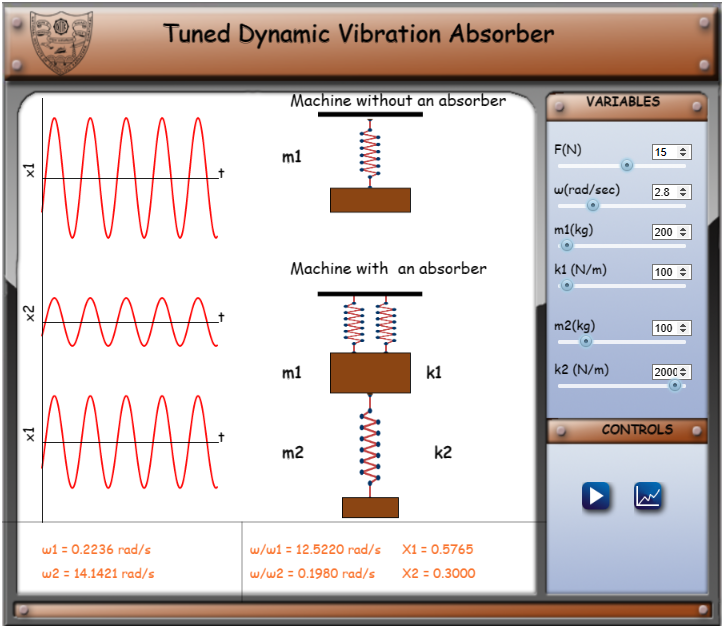
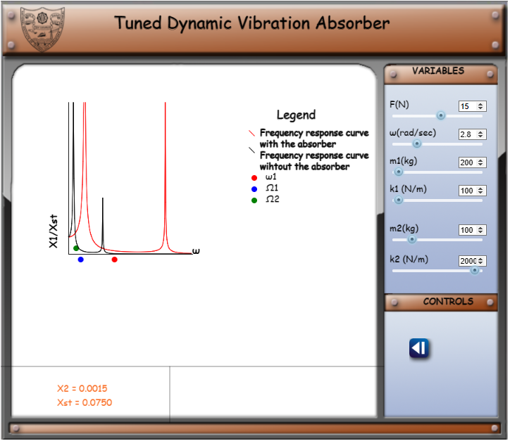

Given Data:

a) m1 = Mass of the machine  
b) k1 = Stiffness of the machine  
c) m2 = Mass of the absorber  
d) k2 = Stiffness of the absorber  

A tuned dynamic vibration absorber is designed to isolate the fundamental natural frequency of the machine away from the excitation frequency. Therefore, for a machine with mass m1 and stifness k1  there exist a vibration absorber of mass m2 and stifness k2. 

Steps to use the simulator:
1. The simulation will open with default values to show the behavior of the system for that input. The user can change it accordingly, to observe different responses.

For a set of mass m1, m2 and stiffness k1 and k2, natural frequencies &omega;1and &omega;2 are displayed. Adjusting &omega; to either of the natural frequencies will show resonance. 

2. Clicking on the graph button will show the plots of frequency ratio versus transmissibility of mass m1 and m2. 

