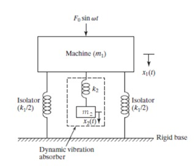

 A vibration absorber is a mechanical device which is tuned to reduce or eliminate undesired vibrations, it must shift the natural frequencies, away from the excitation frequency, as shown in Fig. 1.
 
 

 
Fig. 1 Comparing response of system, with and without absorber
 

 An additional spring mass system is attached to the main spring mass system, so that the resonance of the original system will not occur. The addition of spring mass system results in a two degree of freedom system, having two natural frequencies. General applications include reciprocating tools such as saws, drills, rotary hammers which requires to balance the reciprocating force. Fig. 1 shows a schematic representation of an undamped dynamic vibration absorber.

 

 

Fig. 2 Undamped dynamic vibration absorber.

Mathematically, a mass m2 attached to a machine of mass m1, through a stiffness of k<sum>2, will be
 

By assuming harmonic solution, 
 

The steady state amplitudes are,
 

To reduce amplitude of m1, X1 is substituted as zero, leading to 
 

The absorber is designed such that the amplitude of vibration of the machine, while operating at its original resonant frequency, will be zero.
 
By defining,
 

and the natural frequency of m1 and m2 as &omega;1 and &omega;2 ,
 

The steady state amplitudes can be written as,

 

At &omega;=&omega;1 substituting X1 = 0, which gives,
 
 

This shows that the force exerted by the auxiliary spring is opposite to the impressed force, neutralizing it, thus reducing X1 to zero.
